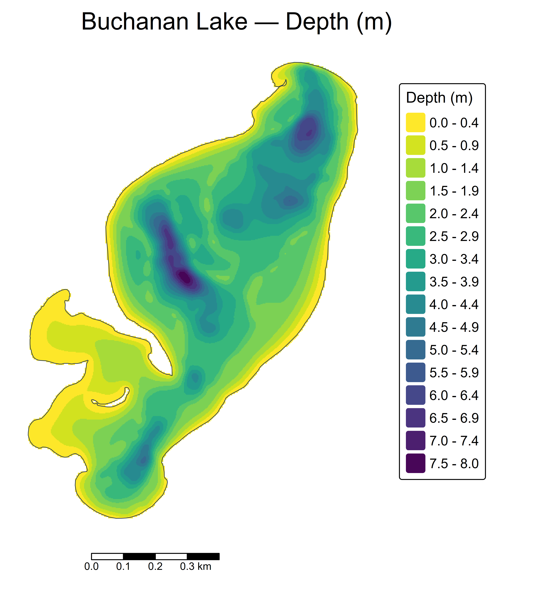

# Lake Bathymetry (R)

Interactive, R-only workflow to (1) georeference a scanned contour map, (2) trace depth contours by hand, and (3) interpolate a clean depth raster/figure for a lake report. The whole process runs in R with leaflet/mapedit.

<p align="center">
  
</p>

## What this does

1. **Digitize contours from a scan**  
   - Georeference a scanned contour map using on-screen Ground Control Points (GCPs).  
   - Optionally crop and mask to the lake outline.  
   - Trace contour lines interactively and store depths in meters.  
   - **Outputs:**  
     - `buchanan_georef.tif` — georeferenced scan (default CRS: EPSG:26915)  
     - `buchanan_contours.gpkg` — traced contours with a `DEPTH_M` field  
     - `buchanan_contours_map.png` — quick visual check (scan + colored lines)

2. **Make a depth heatmap from contours**  
   - Sample points along contours and shoreline (depth=0).  
   - IDW-interpolate to a raster, clip/smooth, and export a figure.  
   - **Outputs:**  
     - `buchanan_depth_heatmap.tif` — GeoTIFF, depth in meters  
     - `buchanan_depth_heatmap.png` — publication-ready figure

---

## Requirements

- **R ≥ 4.2**  
- **System GDAL/PROJ/GEOS** (required by `{sf}` and used via `sf::gdal_utils`)

### R packages

Install once:

```r
install.packages(c(
  "sf","terra","tiff","leaflet","leafem","mapedit","tmap",
  "dplyr","readr","raster","gstat","viridisLite"
))
```

## Quick start
1. Place your scanned depth map TIFF and hydrography GPKG under data/.
2. Open 01_digitize_contours.R and set the "User settings" block (path/CRS).
3. Run the script:
  - Crop: click top left and bottom right of the map frame, then right click and select stop.
  - GCPs: click 6-12 distinct features on the scane, then click the same features in the same order on the basemap.
  - Trace contours: draw polylines following depth lines.
  - Enter depths: optional quick prompt in feet, or fill the DEPTH_M field later in a GIS/table editor, or use the extra scritps.
4. Open 02_make_depth_map.R, set paths/parameters, and run.
